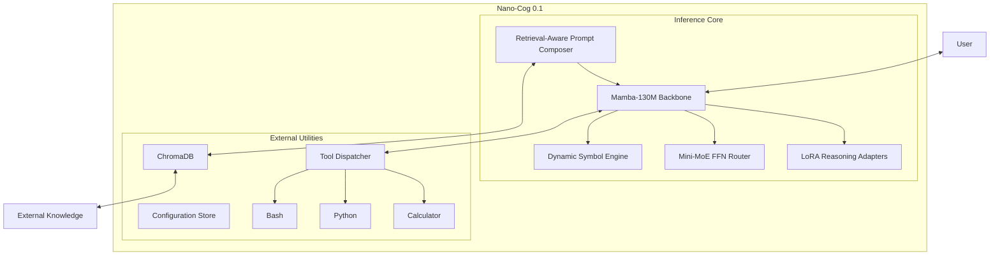

```mermaid
graph TD
    subgraph "Nano-Cog 0.1"
        subgraph "Inference Core"
            A[Mamba-130M Backbone]
            B[LoRA Reasoning Adapters]
            C[Mini-MoE FFN Router]
            D[Dynamic Symbol Engine]
            E[Retrieval-Aware Prompt Composer]
            
            A --> B
            A --> C
            A --> D
            E --> A
        end
        
        subgraph "External Utilities"
            F[ChromaDB]
            G[Tool Dispatcher]
            H[Configuration Store]
            
            G1[Calculator]
            G2[Python]
            G3[Bash]
            
            G --> G1
            G --> G2
            G --> G3
        end
        
        E <--> F
        A <--> G
    end
    
    User[User] <--> A
    F <--> KnowledgeBase[External Knowledge]
``` 